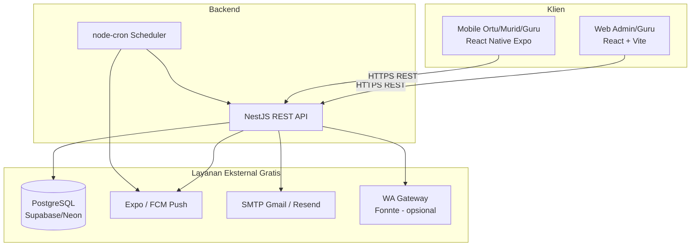
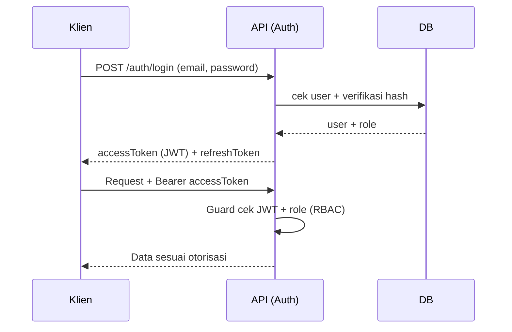
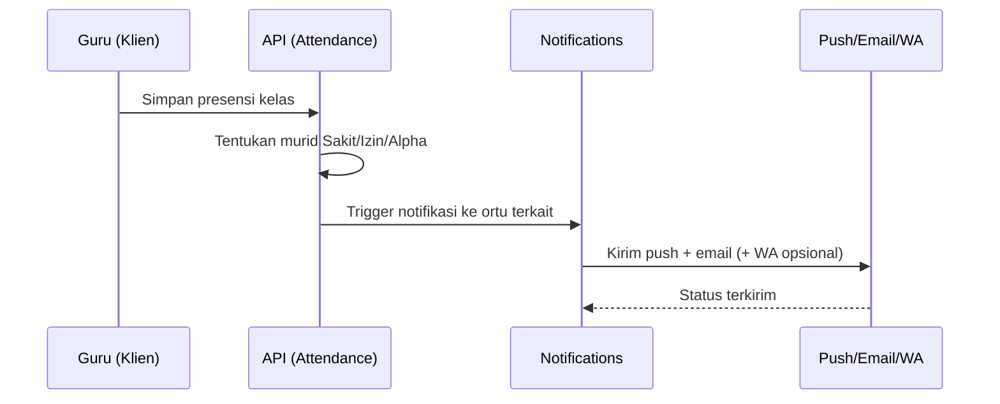
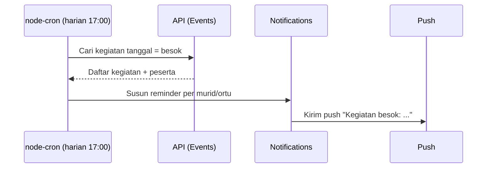

# Arsitektur Sistem — SIPRES Kartini

## 1. Gambaran Umum

Sistem terdiri dari **3 klien** dan **1 backend API** terpusat yang berbagi satu
database. Pendekatan **API-first** memastikan web dan mobile memakai logika bisnis
yang sama.



## 2. Lapisan Backend (NestJS)

Mengikuti **modular architecture** NestJS — tiap domain adalah satu module.

```
backend/src/
├── auth/            # Login, JWT, refresh token, guards
├── users/           # CRUD user + assign role (admin)
├── classes/         # CRUD kelas
├── students/        # CRUD murid (NISN, nama, kelas, dll.)
├── subjects/        # CRUD mata pelajaran
├── schedules/       # Jadwal mapel (hari, jam, kelas, guru)
├── events/          # Kegiatan sekolah yang bisa diabsen
├── attendance/      # Input & rekap presensi
├── reports/         # Kalkulasi persentase kehadiran
├── notifications/   # Push, email, WA + template
├── scheduler/       # node-cron (reminder H-1)
└── common/          # Guards, interceptors, DTO, util, RBAC
```

### Pola Desain

- **Controller → Service → Repository (Prisma)** untuk pemisahan tanggung jawab.
- **DTO + validation** (class-validator) di setiap endpoint.
- **RBAC Guard** berbasis role pada level route.
- **Interceptor** untuk audit log & format response konsisten.

## 3. Lapisan Frontend Web (Admin/Guru)

```
web/src/
├── pages/           # Halaman per modul (Dashboard, Users, Classes, ...)
├── components/      # Komponen UI reusable (shadcn/ui)
├── features/        # State + hooks per domain (React Query)
├── lib/             # API client (axios), util, auth
├── routes/          # Routing + proteksi role
└── styles/          # Tailwind config & tokens
```

- **State server**: TanStack Query (caching, refetch).
- **State global**: Zustand/Context (auth, UI).
- **Routing**: React Router dengan **route guard** per role.

## 4. Lapisan Mobile (Ortu/Murid + Guru)

```
mobile/src/
├── screens/         # Login, Beranda, Kehadiran, Persentase, Notifikasi
├── components/       # UI reusable
├── navigation/      # Stack & tab navigator
├── services/        # API client + push token registration
└── hooks/           # Data fetching (React Query)
```

- **Push**: registrasi Expo Push Token saat login → disimpan di backend.
- **OTA update** via Expo untuk perbaikan cepat tanpa rilis ulang store.

## 5. Alur Autentikasi



## 6. Alur Notifikasi Kehadiran



## 7. Alur Reminder H-1 (Scheduler)



## 8. Deployment (Free Tier)

| Komponen | Platform | Catatan |
|----------|----------|---------|
| API NestJS | Railway / Render / Fly.io | Auto-deploy dari GitHub |
| PostgreSQL | Supabase / Neon | Free tier + backup |
| Web | Vercel / Netlify | Build dari `web/` |
| Mobile | Expo EAS | Build APK gratis + OTA |
| CI/CD | GitHub Actions | Lint, test, build per push/PR |

## 9. Prinsip Skalabilitas & Maintainability

- **Stateless API** → mudah di-scale horizontal jika perlu.
- **Modular** → fitur baru (mis. presensi QR) ditambah tanpa merombak inti.
- **Env-based config** (`.env`) untuk kredensial & toggle fitur.
- **Migrasi DB terversioning** (Prisma Migrate).
