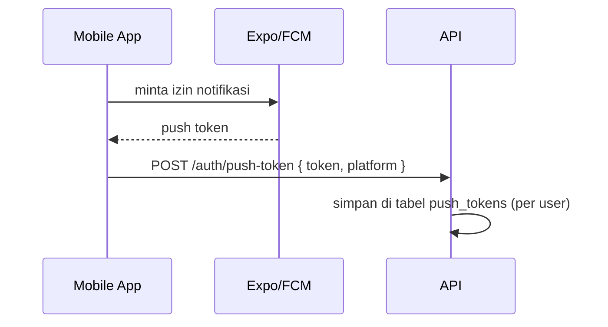

# Strategi Notifikasi — SIPRES Kartini

Tujuan: kehadiran murid ter-report ke orang tua, dan reminder kegiatan H-1.
Prioritas **gratis**.

## 1. Kanal & Pilihan Gratis

| Kanal | Layanan | Status Gratis | Catatan |
|-------|---------|---------------|---------|
| **Push Mobile** | Expo Push / Firebase Cloud Messaging | ✅ Sepenuhnya gratis | Kanal utama, andal |
| **Email** | Gmail SMTP (Nodemailer) / Resend free tier | ✅ Gratis (ada batas harian) | Untuk laporan & rekap |
| **WhatsApp** | Fonnte / WA gateway free tier | ⚠️ Kuota terbatas / tidak resmi | Opsional, hati-hati ToS |

> **Penting**: WhatsApp Business API **resmi berbayar**. Untuk benar-benar gratis,
> andalkan **push notification** (mobile) + **email**. WA gateway pihak ketiga bisa
> dipakai sebagai pelengkap dengan kuota terbatas.

### Rekomendasi

- **Kanal utama orang tua**: Push (mobile) + Email.
- **WA**: aktifkan via toggle pengaturan jika sekolah punya akun gateway.
- Sistem dirancang **multi-channel** — tinggal aktif/nonaktifkan per kanal.

## 2. Jenis Notifikasi

| Jenis | Pemicu | Penerima | Kanal |
|-------|--------|----------|-------|
| **Laporan Kehadiran** | Guru menyimpan presensi | Ortu murid (Sakit/Izin/Alpha, atau semua) | Push + Email (+WA) |
| **Rekap Mingguan** (opsi) | Cron tiap akhir pekan | Ortu | Email |
| **Reminder Kegiatan H-1** | Cron harian (mis. 17:00) | Murid/Ortu peserta kegiatan | Push |
| **Info/Pengumuman** | Admin kirim manual | Target dipilih | Push + Email |

## 3. Alur Laporan Kehadiran

1. Guru menyimpan presensi satu sesi (`PUT /attendance/sessions/:id`).
2. Backend mendeteksi murid dengan status **SAKIT / IZIN / ALPHA**
   (atau semua status, sesuai pengaturan sekolah).
3. Untuk tiap murid, ambil **akun ortu** dari `student_parents`.
4. Kirim notifikasi ke kanal aktif (push token + email + WA bila ada).
5. Simpan ke tabel `notifications` untuk inbox & status baca.

Contoh isi pesan:

> 📚 *SIPRES Kartini* — Ananda **Budi (XII IPA 1)** tercatat **ALPHA** pada
> mata pelajaran *Matematika*, Jumat 13 Jun 2026. Hubungi wali kelas bila ada
> pertanyaan.

## 4. Alur Reminder Kegiatan H-1

Dijalankan oleh **node-cron** di backend (tanpa biaya tambahan).

```
Setiap hari pukul 17:00:
  events = SELECT * FROM events WHERE event_date = besok
  untuk tiap event:
    peserta = murid di target_class_id (atau semua jika null)
    untuk tiap murid:
      kirim PUSH ke murid & ortu:
        "Reminder: besok ada {title} jam {start_time} di {location}"
```

Implementasi NestJS (ilustrasi):

```ts
@Cron('0 17 * * *') // setiap hari 17:00
async sendH1Reminders() {
  const besok = addDays(new Date(), 1);
  const events = await this.events.findByDate(besok);
  for (const ev of events) {
    const recipients = await this.events.getRecipients(ev);
    await this.push.sendMany(recipients, {
      title: 'Reminder Kegiatan Besok',
      body: `${ev.title} jam ${ev.startTime} di ${ev.location}`,
    });
  }
}
```

## 5. Registrasi Push Token (Mobile)



- Token disimpan per user; saat kirim push, ambil semua token user penerima.
- Token kedaluwarsa/invalid dibersihkan otomatis saat pengiriman gagal.

## 6. Template & Pengaturan

- Template pesan disimpan agar mudah diubah admin (judul + body dengan placeholder
  `{nama}`, `{kelas}`, `{status}`, `{mapel}`, `{tanggal}`).
- Pengaturan sekolah: kanal aktif, jam reminder, kirim notif untuk status apa saja.

## 7. Keandalan

- **Retry** pengiriman gagal (queue sederhana).
- **Log** status terkirim di tabel `notifications`.
- Validasi nomor HP & email saat onboarding untuk mengurangi kegagalan.
